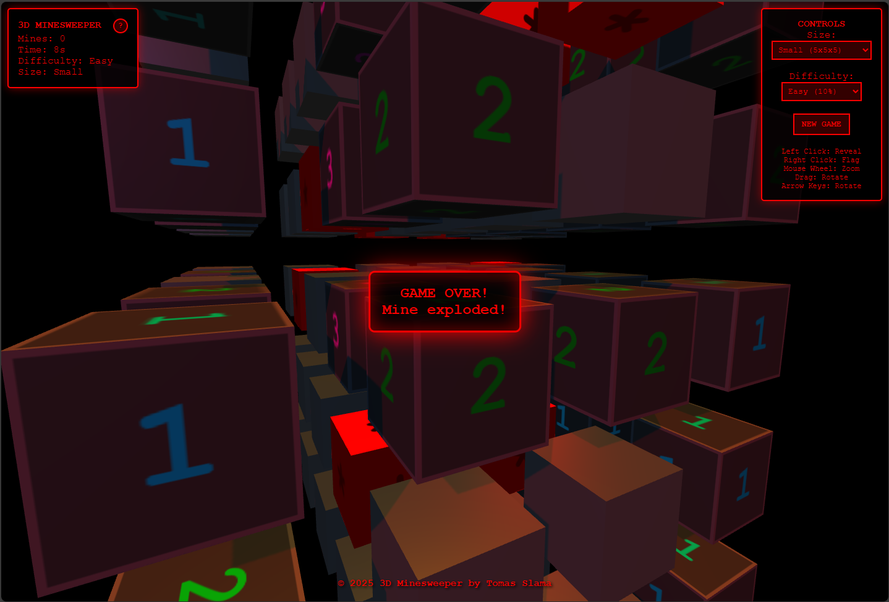
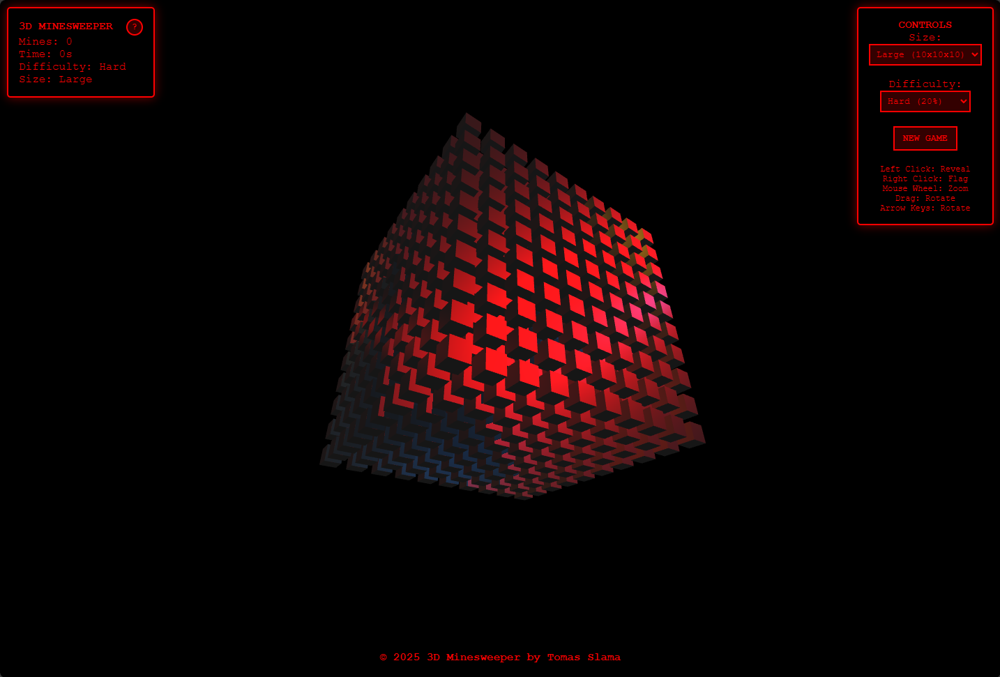
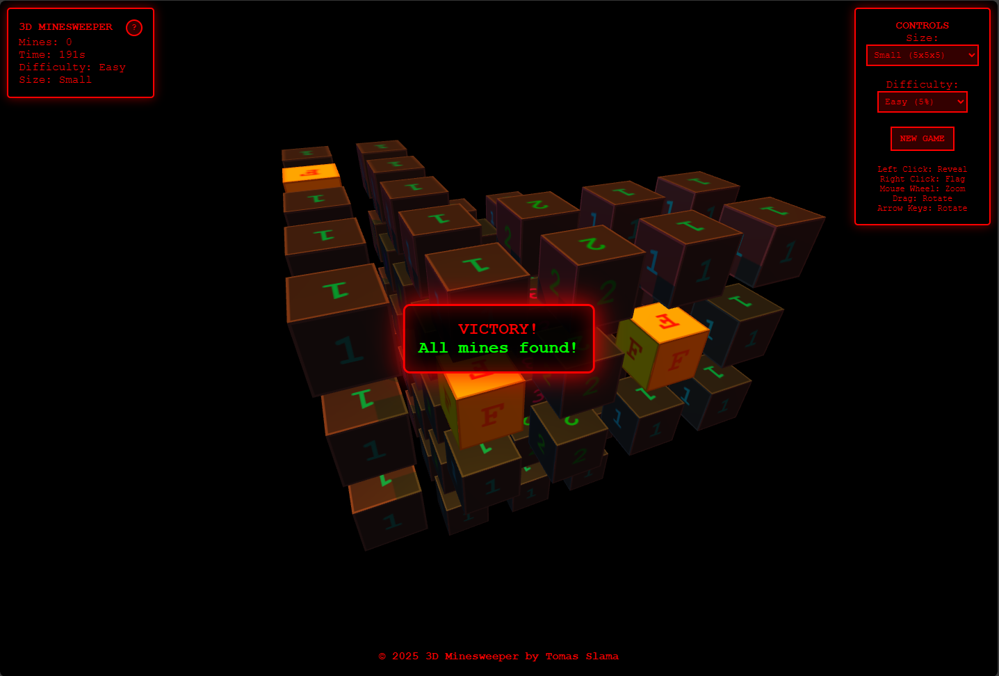
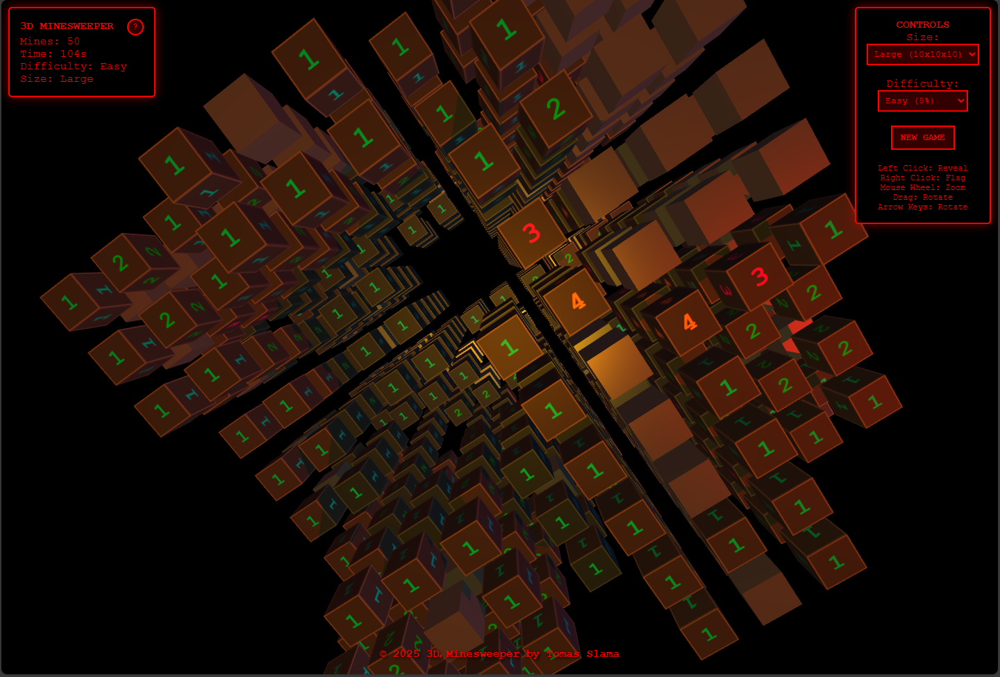

# 3D Minesweeper

A classic game of Minesweeper reimagined in a 3D environment

## Gameplay

The objective of the game is to clear a 3D grid containing hidden "mines" without detonating any of them, with help from clues about the number of neighboring mines in each field.

- **Left Click / Tap:** Reveal a block.
- **Right Click / Long Press:** Flag or unflag a block suspected of containing a mine.
- **Numbers on Blocks:** Indicate how many mines are adjacent to that block (in all 26 surrounding directions).
- **Empty Blocks:** Revealing an empty block will automatically reveal all adjacent empty blocks and numbered blocks.

## Controls

- **Mouse Drag / Touch Drag:** Rotate the camera around the grid.
- **Mouse Wheel / Pinch Gesture:** Zoom the camera in or out.
- **Arrow Keys:** Rotate the camera using the keyboard.

## How to Win

You win the game if you achieve EITHER of the following:

1.  Successfully flag all the blocks that contain mines (and do not incorrectly flag any safe blocks).
2.  Successfully reveal all the blocks that do not contain mines.

## Screenshots

Here are some screenshots of the game in action:

_Caption: Navigating the 3D minefield._

_Caption: Would you like the hard mode? 💪_

_Caption: A tense moment before revealing the last block._

_It’s a bit like Cube 💀_

## How to Run

1.  Download or clone this repository.
2.  Open the `index.html` file in a modern web browser (e.g., Chrome, Firefox, Edge).

Enjoy the game!